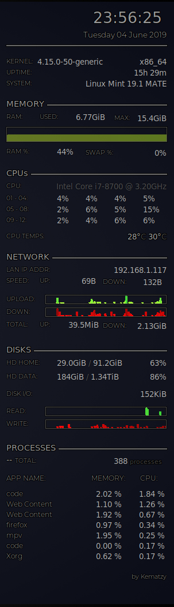
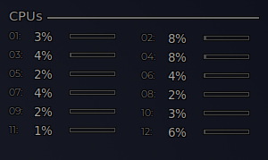

# conky.conf

My personal version of [Conky](https://github.com/brndnmtthws/conky) config.

This configuration is for **Linux Mint MATE 19.1 (Tessa)** on a dual-screen setup of **1920 x 1080** monitors.

This is the end result:




## Alternative CPU display:

My design have limited space for the CPU display, but if you have the space this alternative design may suit you better:



To implement this design, just copy the code below:

```lua
${font :size=11}${color1}CPUs ${color6}${hr 2}${color}
${voffset -15}
${font Montserrat Light:size=8}${color1}01:${color}${font} ${font :size=10}${goto 40}${cpu cpu1 }% ${goto 80}${color4}${cpubar cpu1  4,50}${color} ${goto 160}${font Montserrat Light:size=8}${color1}02:${color}${font} ${goto 190}${font :size=10}${cpu cpu2 }% ${goto 230}${color4}${cpubar cpu2  4,50}${color}
${font Montserrat Light:size=8}${color1}03:${color}${font} ${font :size=10}${goto 40}${cpu cpu3 }% ${goto 80}${color4}${cpubar cpu3  4,50}${color} ${goto 160}${font Montserrat Light:size=8}${color1}04:${color}${font} ${goto 190}${font :size=10}${cpu cpu4 }% ${goto 230}${color4}${cpubar cpu4  4,50}${color}
${font Montserrat Light:size=8}${color1}05:${color}${font} ${font :size=10}${goto 40}${cpu cpu5 }% ${goto 80}${color4}${cpubar cpu5  4,50}${color} ${goto 160}${font Montserrat Light:size=8}${color1}06:${color}${font} ${goto 190}${font :size=10}${cpu cpu6 }% ${goto 230}${color4}${cpubar cpu6  4,50}${color}
${font Montserrat Light:size=8}${color1}07:${color}${font} ${font :size=10}${goto 40}${cpu cpu7 }% ${goto 80}${color4}${cpubar cpu7  4,50}${color} ${goto 160}${font Montserrat Light:size=8}${color1}08:${color}${font} ${goto 190}${font :size=10}${cpu cpu8 }% ${goto 230}${color4}${cpubar cpu8  4,50}${color}
${font Montserrat Light:size=8}${color1}09:${color}${font} ${font :size=10}${goto 40}${cpu cpu9 }% ${goto 80}${color4}${cpubar cpu9  4,50}${color} ${goto 160}${font Montserrat Light:size=8}${color1}10:${color}${font} ${goto 190}${font :size=10}${cpu cpu10}% ${goto 230}${color4}${cpubar cpu10 4,50}${color}
${font Montserrat Light:size=8}${color1}11:${color}${font} ${font :size=10}${goto 40}${cpu cpu11}% ${goto 80}${color4}${cpubar cpu11 4,50}${color} ${goto 160}${font Montserrat Light:size=8}${color1}12:${color}${font} ${goto 190}${font :size=10}${cpu cpu12}% ${goto 230}${color4}${cpubar cpu12 4,50}${color}
${voffset -12}
```


### CONKY MAN PAGE

A quick and dirty conversion of Conky's `man` page is enclosed for reference of Conky's various settings and features.

[Conky Man Page](/Conky-Man-Page.md)


## LICENCE

MIT or Do Whatever You Want 

IF it breaks on your system, then just work it out yourself. No warranty expressed or implied and no support provided.

Have a great life.

